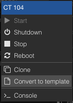
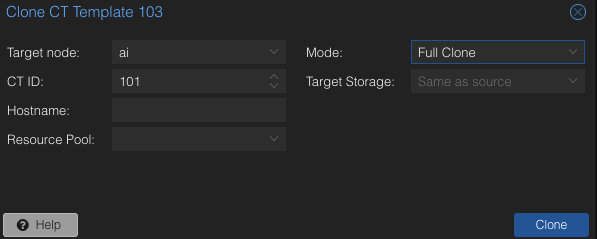

# create-proxmox-nvidia-containers
Scripts for creating Proxmox VE LXC containers with nvidia GPU permissions based on https://jocke.no/2025/04/20/plex-gpu-transcoding-in-docker-on-lxc-on-proxmox-v2/

These were _absolutely_ vibe-coded (using Gemini) as my sed, awk, and grep skills are pretty rusty, but these scripts were tested on Proxmox VE 8.4.5 with Debian 12.11.

# Proxmox setup prior to containers

We need to update the `/etc/apt/sources.list` file to include non-free and non-free-firmware sources so that we can install the nvidia drivers.

```bash
curl -o- https://raw.githubusercontent.com/dmbeta/create-proxmox-nvidia-containers/main/update_debian_sources.sh | bash
apt update
apt install proxmox-headers-$(uname -r)
wget https://developer.download.nvidia.com/compute/cuda/repos/debian12/x86_64/cuda-keyring_1.1-1_all.deb
dpkg -i cuda-keyring_1.1-1_all.deb
apt update
apt install nvidia-driver-cuda nvidia-kernel-dkms
reboot now
```

# Usage
1. Create a new LXC container with the following options:
    - Container type: Container
    - OS: Debian
    - Version: 12 (Bookworm)

    But do not start it just yet.

2. Add the necessary cgroup2 devices and lxc mount points to the container's configuration file. You can generate them by utilizing the generate_lxc_conf_additions.sh script by running:

    ```bash
    # run on the host
    curl -o- https://raw.githubusercontent.com/dmbeta/create-proxmox-nvidia-containers/main/generate_lxc_conf_additions.sh | bash
    ```

    and then copy the output to the container's configuration file, usually located at /etc/lxc/<container_id>.conf.

NOTE: All following commands can be run from the container, or pushed to the container by running on the host with the command copied inside like so:

```bash
pct exec <container_id> -- sh -c "<command>"
```

1. Start the container and then run the following command inside to install the NVIDIA driver on the container.

    First install sudo and curl if they are not already installed.

    ```bash
    apt-get install -y sudo curl
    ```

    Then run the following:

    ```bash
    curl -o- https://raw.githubusercontent.com/dmbeta/create-proxmox-nvidia-containers/main/install_nvidia_driver_on_container.sh | bash
    ```

2. (Optional) Configure unattended-upgrades for the container while disabling unattended-upgrades for nvidia driver updates. This is so that you can keep the container up to date with the latest security updates, but nvidia driver updates require a different approach to avoid conflicts with the host.

    ```bash
    curl -o- https://raw.githubusercontent.com/dmbeta/create-proxmox-nvidia-containers/main/install_unattended_upgrades_on_container.sh | bash
    ```

3. (Optional) Install docker and the NVIDIA Container Toolkit on the container. This is required for running NVIDIA containers on the container.

    ```bash
    curl -o- https://raw.githubusercontent.com/dmbeta/create-proxmox-nvidia-containers/main/install_docker_and_nvidia_runtime.sh | bash
    ```

4. (Optional, but recommended): Once you verify the container works using `nvidia-smi` and a sample container, turn it into a template. This will allow you to easily create new containers from this template.

    ```bash
    rm /etc/ssh/ssh_host_*
    truncate -s 0 /etc/machine-id
    shutdown now
    ```

    In the UI, right click the (now stopped) container, and select "Convert to template". This requires that there are no snapshots of the container, and you won't be able to run the container after converting to a template.

    

    You can then create new containers from this template by right clicking the template and selecting clone. When cloning, change mode to "Full Clone".

    


# Upgrade NVIDIA Driver on Host and Containers

This script assumes all running containers are using the GPU. If you have containers that are not using the GPU, I'd recommend stopping them before running this script. This script will upgrade the NVIDIA driver on the host, the containers, restart the containers, and then restart the host.

    ```bash
    # please run this on the docker host
    curl -o- https://raw.githubusercontent.com/dmbeta/create-proxmox-nvidia-containers/main/upgrade_host_and_containers.sh | bash
    ```